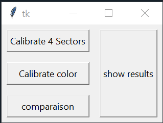
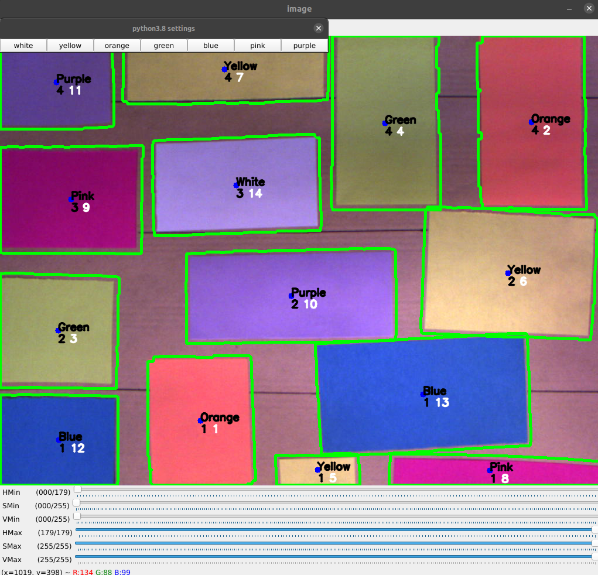
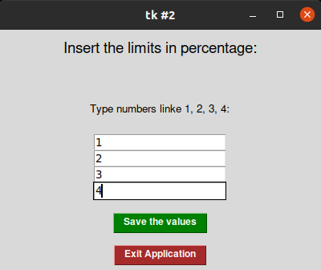

# Simple Color detection repository

Python code for the implementation of the color detection.

## Installation

Use the package manager [pip](https://pip.pypa.io/en/stable/) to install cv2, pandas and numpy.

```bash
pip install numpy
pip install cv2
pip install pandas
pip install tkinter
```

## Usage
Please RUn GUI.py to start the program

Main interface for the calibration:



Color calibration interface:



Limit calibration interface:




```python
python interface.py
python tool.py
python main2.py
```


## Contributing
Pull requests are welcome. For major changes, please open an issue first to discuss what you would like to change.

Please make sure to update the libraries before appropriate.
